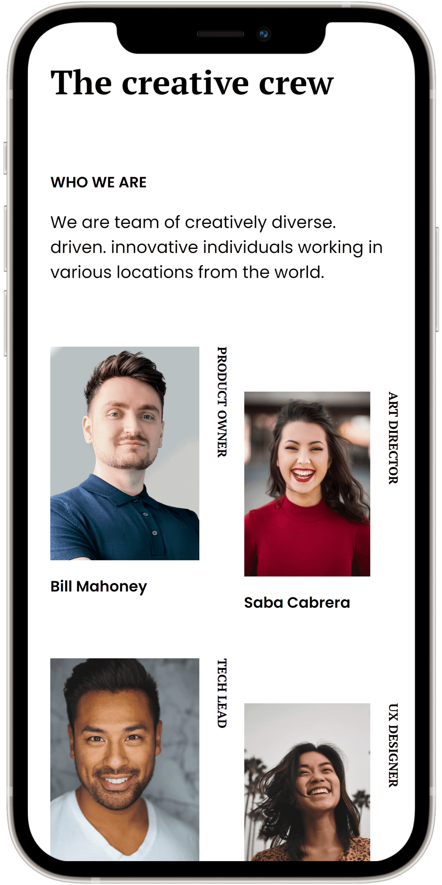

<!-- Please update value in the {}  -->

<h1 align="center">My Team Page</h1>

   Solution for a challenge from  <a href="http://devchallenges.io" target="_blank">Devchallenges.io</a>.

  <h3>
    <a href="https://my-team-page-devchallenges-pk.vercel.app/">
      Demo
    </a>
     | 
    <a href="https://github.com/ProboKrishnacahya/My_Team_Page_devChallenges">
      Solution
    </a>
     | 
    <a href="https://devchallenges.io/challenges/hhmesazsqgKXrTkYkt0U">
      Challenge
    </a>
  </h3>

<!-- TABLE OF CONTENTS -->

## Table of Contents

- [Overview](#overview)
- [Built With](#built-with)
- [Features](#features)
- [Contact](#contact)

<!-- OVERVIEW -->

## Overview

### Built With

<!-- This section should list any major frameworks that you built your project using. Here are a few examples.-->

- [HyperText Markup Language 5](http://www.w3.org/TR/html5/)
- [Cascading Style Sheets 3](http://www.w3.org/TR/CSS/)

## Features

<!-- List the features of your application or follow the template. Don't share the figma file here :) -->

This application/site was created as a submission to a [DevChallenges](https://devchallenges.io/challenges) challenge. The [challenge](https://devchallenges.io/challenges/hhmesazsqgKXrTkYkt0U) was to build an application to complete the given user stories.

- I can see a page following the given design.

## Contact

- Website [https://rebrand.ly/probo-krishnacahya](https://rebrand.ly/probo-krishnacahya)
- GitHub [@ProboKrishnacahya](https://github.com/ProboKrishnacahya)
- Twitter [@pkrishnacahya](https://twitter.com/pkrishnacahya)

---

`2022 - Probo Krishnacahya`
